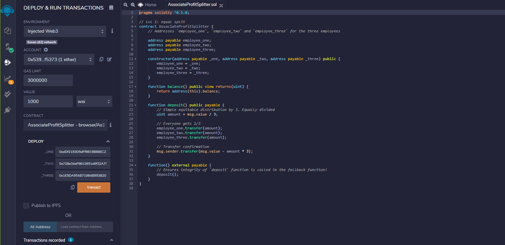
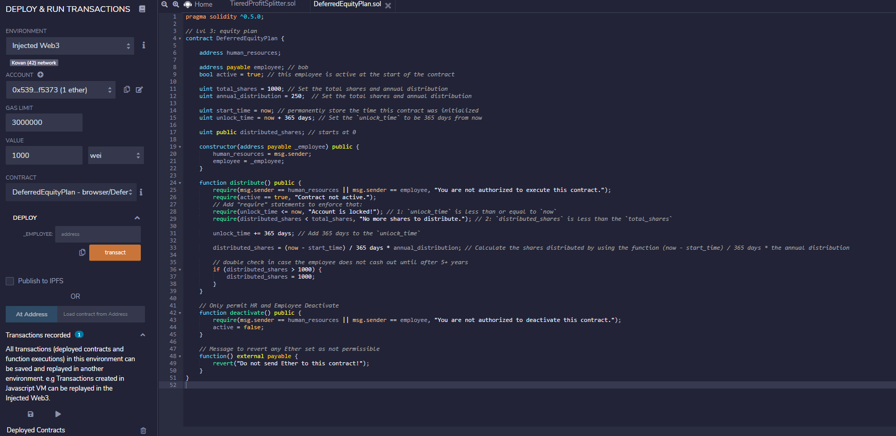
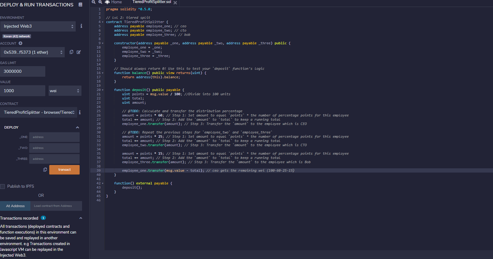

# SOLIDITY

__Title__: Application of deep learning recurrent neural networks to model to bitcoin prices using combination of sentiment and timeseries techniques  
__Submitted by__: Amar Munipalle  

## Background

Smart contracts to automate certain compensation plans. Use Ethereum payout to

* Pay associate-level employees quickly and easily and in a simple manner

* Distribute profits to different tiers of employees; with executive suite garnering bulk of compensation

* Distribute company shares for employees in a "deferred equity incentive plan" automatically. By activating contract on certain dates

